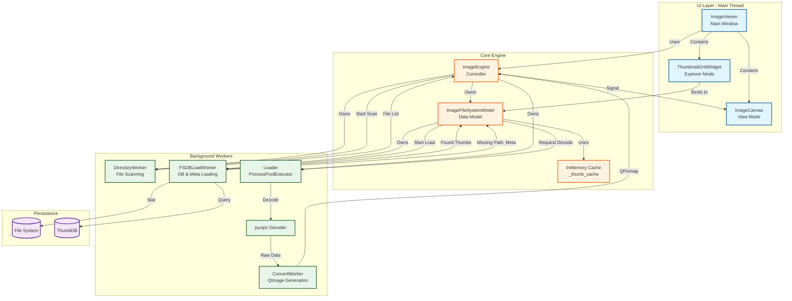
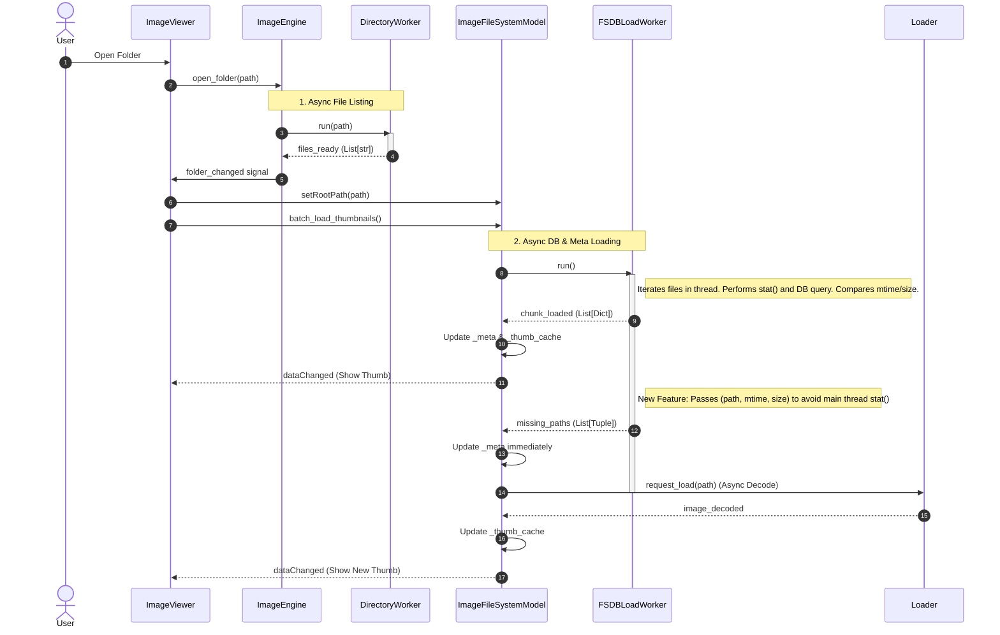

# Image Viewer Project Architecture

This document visualizes the structure and data flow of the `image_viewer` project, reflecting the current codebase state as of Dec 2025.

## 1. System Architecture Overview

This flowchart illustrates how the UI decouples from the backend operations using the `ImageEngine` and various background workers.

---

## 2. Sequence Diagram: Open Folder (Async Loading)

This diagram details the sequence when a user opens a folder. It highlights the optimizations made to prevent UI freezing by offloading I/O and metadata reading to the `FSDBLoadWorker`.

